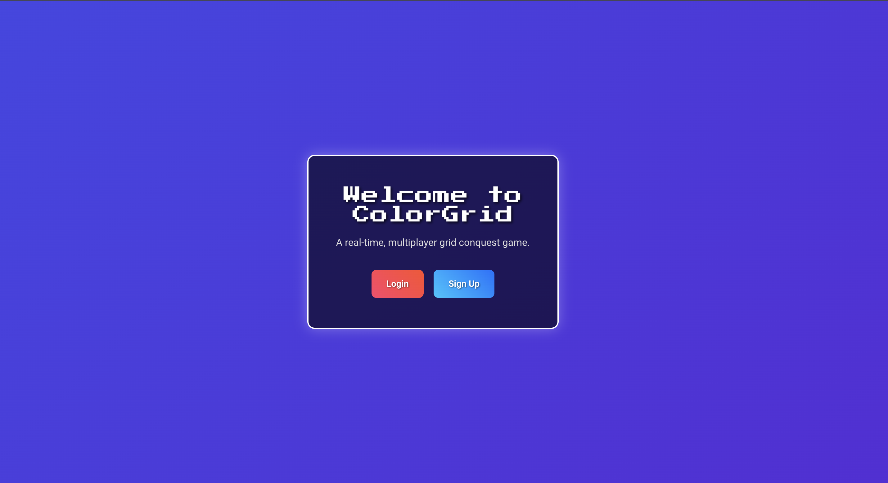
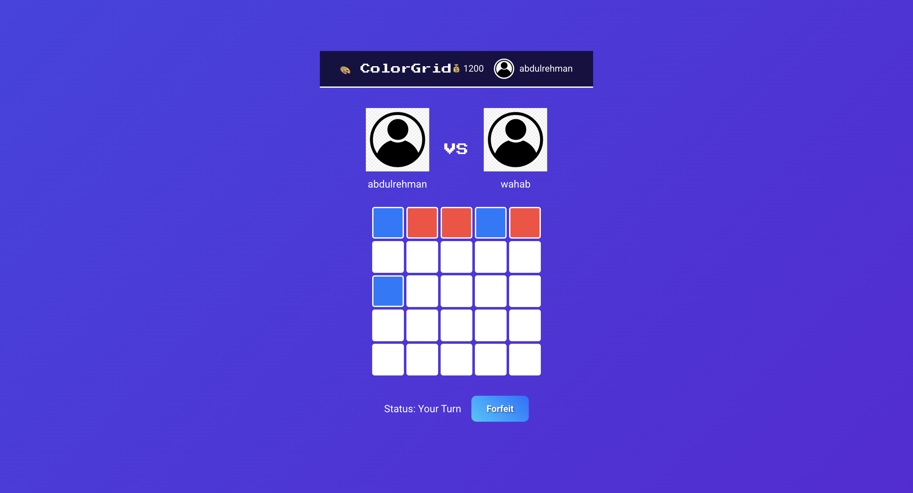

# 🎨 ColorGrid – Real-Time Color Conquest Game

ColorGrid is a 2-player, real-time, turn-based color conquest game built using the **MERN stack (MongoDB, Express, React, Node.js)** with **Socket.IO** for seamless gameplay synchronization. Inspired by simple classics like Tic Tac Toe and Connect-X, this game introduces a competitive twist where players battle to dominate the board through color.

<br/>

## 🚀 Features

- 🔵 5x5 interactive color grid
- 🔴 Real-time two-player matchmaking via Socket.IO
- 🟢 Turn-based gameplay with status updates
- 🟡 Coin-based reward system for wins/losses
- ⚫ Leaderboard & player history tracking
- ⚪ User authentication with profile customization
- 🧠 Winner determined via largest connected island (BFS/DFS logic)

<br/>

## 📸 Demo

| Welcome | Matchmaking | Gameplay |
|---------|-------------|----------|
|  |  |  |


<br/>

## 🧩 Tech Stack

**Frontend:**
- React (with Hooks & Context API)
- Vite
- React Router
- Socket.IO Client

**Backend:**
- Express.js
- Socket.IO Server
- MongoDB (with Mongoose)
- Node.js

<br/>

## 🧠 Game Rules

- Two players are matched randomly and assigned unique colors.
- Each turn, a player colors one empty cell.
- Game ends when all 25 cells are filled or a player forfeits.
- The winner is the one with the **largest connected island** (horizontally/vertically).
- Server calculates results and updates MongoDB.
- Coins are awarded or deducted based on outcomes.

<br/>

## 📁 Project Structure

```

client/       # React frontend
server/       # Express + Socket.IO backend
design/       # HTML/CSS templates for views
public/       # Static assets (images/screenshots)

````

<br/>

## 🧪 Setup & Run Locally

### 1. Clone the repository

```bash
git clone https://github.com/arehmanbutt/colorgrid.git
cd colorgrid
````

### 2. Install dependencies

```bash
cd client
npm install
cd ../server
npm install
```

### 3. Create `.env` in `server/`

```
PORT=8000
MONGO_URI=<your_mongodb_connection_string>
```

### 4. Start the app

* Start the server:

```bash
cd server
npm run dev
```

* Start the client:

```bash
cd ../client
npm run dev
```

* Visit: [http://localhost:5173](http://localhost:5173)

<br/>

## 🛠 Core Functionality (Socket Events)

**Client Emits:**

* `find_match` – Request matchmaking
* `make_move` – Make a move on your turn
* `forfeit_game` – Forfeit current game

**Server Emits:**

* `start_game` – Send player info & game ID
* `move_made` – Sync game state after a move
* `game_end` – Broadcast result and update UI

<br/>

## 🔐 Auth & User Features

* Signup/Login
* Coin balance tracking
* Update username, password, profile picture
* Leaderboard & past game history

<br/>

## 🧾 Example MongoDB Schema

```json
// User
{
  "_id": "...",
  "username": "Alice",
  "password": "hashed_pw",
  "profile_picture_url": "...",
  "coins": 1200
}

// Game
{
  "_id": "...",
  "player1_id": "...",
  "player2_id": "...",
  "final_grid": [[...]],
  "result": "draw",
  "winner_id": null
}
```

<br/>

## 🧠 Algorithms

* **Island detection**: Based on BFS/DFS traversal of the grid to compute the largest continuous color block.
* **Matchmaking**: Players are added to a waiting room and paired in FIFO order.
* **State Sync**: Every move updates both clients via sockets for smooth, real-time interaction.

<br/>

## 📌 Future Improvements

* Add animations and sound effects
* Support multiple grid sizes
* Improve responsive UI with Tailwind CSS
* Introduce tournaments or ranked matches

<br/>

## 📸 UI Pages

* `/` Welcome
* `/login` / `/signup`
* `/home` – Dashboard
* `/newgame/waiting` – Matchmaking
* `/newgame/:game_id` – Gameplay
* `/history` / `/history/:game_id`
* `/leaderboard`
* `/update-profile`

<br/>

## 🤝 Contributing

Feel free to fork this repo and submit pull requests for improvements or feature additions!

<br/>

## 📄 License

MIT © [Your Name](https://github.com/arehmanbutt)

---

### 💡 Built with ❤️ for Advanced Programming – Spring 2025
